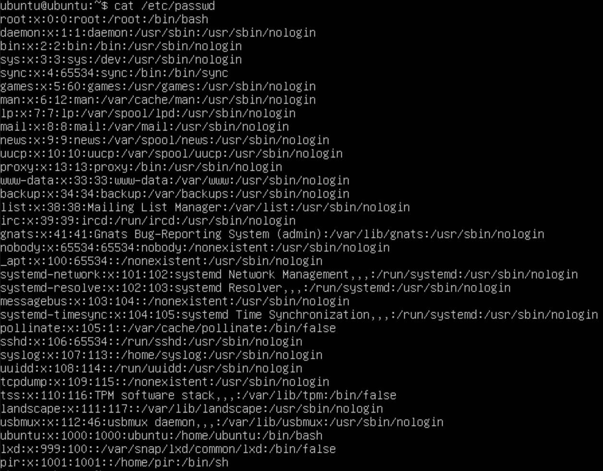
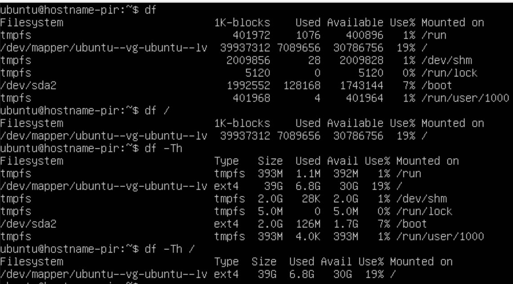
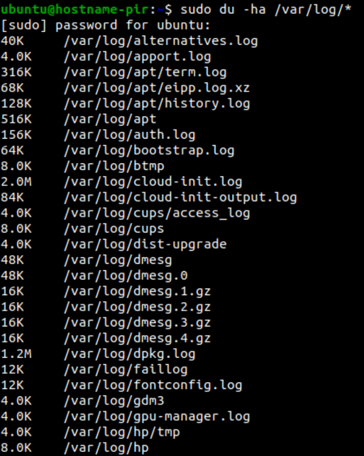

Part 1. Установка ОС
------------------------
  
Установленная версия Ubuntu 20.04 Server LTS без графического интерфейса.

Part 2. Создание пользователя
-----------------------------------
* Команды для создания пользователя и добавления его в группу adm.  
  

* Вывод команды cat /etc/passwd.  
  

Part 3. Настройка сети ОС
-----------------------------------
* Задать название машины вида user-1.  

* Установить временную зону, соответствующую вашему текущему местоположению.
С помощью команды sudo timedatectl set-timezone Europe/Moscow установила нужную временную зону.  

* Вывести названия сетевых интерфейсов с помощью консольной команды.  

Loopback Interface - на Unix-like системах lo или lo0 - виртуальный интерфейс, присутствующий по умолчанию в любом Linux. Он используется для отладки сетевых программ и запуска серверных приложений на локальной машине.  

* Используя консольную команду, получить ip адрес устройства, на котором вы работаете, от DHCP сервера.  

DHCP (англ. Dynamic Host Configuration Protocol — протокол динамической настройки узла) — прикладной протокол, позволяющий сетевым устройствам автоматически получать IP-адрес и другие параметры, необходимые для работы в сети TCP/IP.  

* Определить и вывести на экран внешний ip-адрес шлюза (ip) и внутренний IP-адрес шлюза, он же ip-адрес по умолчанию (gw).  

  
внешний ip-адрес шлюза  

gw: 10.0.2.2    

* Задать статичные настройки ip, gw, dns.  
C помощью команды sudo nano /etc/netplan/00-name-1.yaml вношу в соответствующий файл следующие настройки:  
  
В настройках VB выбираю тип подключения "внутренняя сеть".  
Затем команда sudo netplan try

* Перезагрузить виртуальную машину. Убедиться, что статичные сетевые настройки (ip, gw, dns) соответствуют заданным в предыдущем пункте.  
  

* Успешно пропинговать удаленные хосты 1.1.1.1 и ya.ru.  
 

Part 4. Обновление ОС
----------------------------------------
Были использованы команды:  
sudo apt update  
sudo apt upgrade  
sudo apt autoremove  
sudo apt dist-upgrade  
sudo reboot  
sudo do-release-upgrade
  

Part 5. Использование команды sudo
----------------------------------------
Команда sudo (substitute user and do, подменить пользователя и выполнить) позволяет строго определенным пользователям выполнять указанные программы с административными привилегиями без ввода пароля суперпользователя root.

* Разрешить пользователю, созданному в Part 2, выполнять команду sudo.  
Команда sudo adduser pir sudo, затем:    

  

Part 6. Установка и настройка службы времени
------------------------------------------
  
Для автоматической настройки времени я:  
* отключила стандартную утилиту командами   
sudo systemctl stop systemd-timesyncd   
sudo systemctl disable systemd-timesyncd  

* установила NTP  
sudo apt-get install ntp  
и перезагрузила систему  

  

Part 7. Установка и использование текстовых редакторов
--------------------------------------------------
Создала 3 файла  
  

* Выйти  и сохранить изменения  

  
VIM: :wq    

  
NANO: Ctrl+OX  

  
JOE: Ctrl+KX

* Редактировать и выйти без изменения  

  
VIM: :q!  

  
NANO: Ctrl+X и после запроса не сохранять изменения.  

  
JOE: Ctrl+С  

* Редактировать и выйти без изменения  

  
VIM: :q!  

  
NANO: Ctrl+X и после запроса не сохранять изменения.  

  
JOE: Ctrl+С  

* Поиск и замена слова  

  
VIM поиск  

  
VIM замена

  
NANO: Ctrl+W поиск (слова dom).  

  
NANO: Alt+R вызов команды замены.  

  
JOE: Ctrl+KF поиск.  

  
JOE: после ввода команды поиска выбрать R-Replace, и заменится слово, которое искали.    

Part 8. Установка и базовая настройка сервиса SSHD
---------------------------------------------------
* Установить службу SSHd.  
sudo apt-get install openssh-server  
* Добавить автостарт.  

sudo systemctl enable ssh  

Подключаемся по ssh: ssh ubuntu@hostname-pir 

* Перенастроить службу SSHd на порт 2022.  
С помощью команды sudo nano /etc/ssh/sshd-config  меняем соответствующую строку на "Port 2022"  
  

* Используя команду ps, показать наличие процесса sshd.  
  

**Используем команду ps axvf | grep sshd**  
Значение ps - отображение текущих процессов на экране пользователя.  
ax - показать все процессы.  
-f - полноформатный вывод (отвечает за форматирование).   
-v - показывает формат виртуальной памяти.  
grep sshd - находит на вводе строки регулярное выражение sshd и выводит их.  

* Перезагрузить систему.  
sudo systemctl restart ssh  

* Вывод команды netstat -tan  
  
-n - Отображение адресов и номеров портов в числовом формате.  
-a - Отображение всех подключений и ожидающих портов.  
-t - Отображение текущего подключения в состоянии переноса нагрузки с процессора на сетевой адаптер при передаче данных.  
**Proto:** Протокол (tcp, udp, raw), используемый сокетом.  
**Recv-Q:** Счётчик байтов, не скопированных программой пользователя из этого сокета.  
**Send-Q:** Счётчик байтов, не подтверждённых удалённым узлом.  
**Local Address:** Адрес и номер порта локального конца сокета.  
**Foreign Address:** Адрес и номер порта удалённого конца сокета.  
**State:** Состояние сокета.  

**IP-адрес 0.0.0.0** — это немаршрутизируемый адрес IPv4, который можно использовать в разных целях, в основном, в качестве адреса по умолчанию или адреса-заполнителя. Он не является адресом какого-либо устройства.  

Part 9. Установка и использование утилит top, htop
---------------------------------------------------
* Команда top  
  
**uptime:** 1:46  
**количество авторизованных пользователей:** 3  
**общая загрузку системы:** 0.15, 0.06, 0.01 (через 1, 5 и 15 минут)  
**общее количество процессов:** 131  
**загрузка cpu:**  0.0 us и т.д.  
**загрузка памяти:**  3925.5  
**pid процесса занимающего больше всего памяти:** 1682 
**pid процесса, занимающего больше всего процессорного времени:** 0.3  

* Команда htop  
  
Сортировка по PID  

  
Сортировка по PERCENT_CPU  

  
Сортировка по PERCENT_MEM  

  
Сортировка по TIME  

  
Отфильтрованному для процесса sshd для процесса sshd  

  
С процессом syslog, найденным, используя поиск  

  
С добавленным выводом hostname, clock и uptime  

Part 10. Использование утилиты fdisk
---------------------------------------------
Запустила команду fdisk -l
  
Название жесткого диска: VBOX HARDDISK, его размер: 80 GB, количество секторов: 3.  

Part 11. Использование утилиты df
-----------------------------------------
  
* **df**  
Единица измерения в выводе: KВ.  

* **df -Th**  
Тип файловой системы для раздела: ext4.  

Part 12. Использование утилиты du
----------------------------------------
  
Вывод команды **du**.  

  
Общий размер папок /home, /var, /var/log. Чтобы вывести размер папок внутри этих папок, использовались те же команды без -s.   

  
Размер всего содержимого в /var/log.  

Part 13. Установка и использование утилиты ncdu
---------------------------------------------
  
Размер папки /home.  

  
Размер папки /var.  

  
Размер папки /var/log.  

Part 14. Работа с системными журналами
-------------------------------------------
  
* Время последней успешной авторизации: 15:24, имя пользователя: ubuntu и метод входа в систему: авторизация с помощью пароля (значение tty2).  

* Перезапустить службу SSHd.  
Команда sudo systemctl restart ssh  
  

Part 15. Использование планировщика заданий CRON
---------------------------------------------------
Командой sudo systemctl enable cron задаем работу CRON в фоновом режиме.  

  
Содержимое журнала /var/log/syslog со строчками о выполнении команды uptime каждые 2 минуты.  

crontab -l - вывести экран список текущих заданий для CRON, crontab -e - редактирование файла с задачами (результат редактирования ниже).  

  

